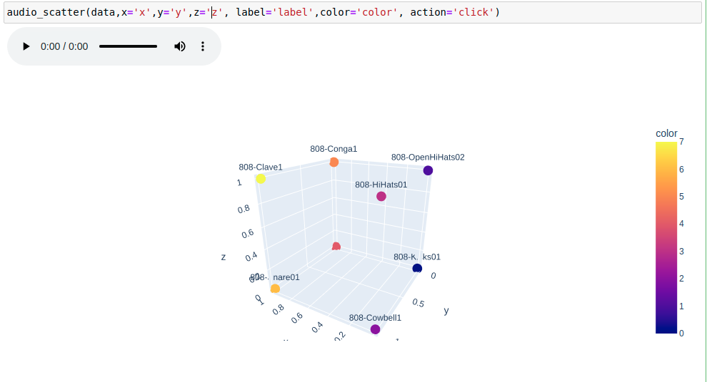

# Audio Scatter (plot)

Play sound clicking on a scatterplot on jupyter

```python

from audio_scatter.plotly import audio_scatter

audio_scatter(data,x='x',y='y',z='z', label='label',color='color', action='click')
```




## Run demo

Demo example in Demo.ipynb

## Legacy

If using without plotly and if %matplotlib widgets is used insted of %matplotlib notebook, install ipympl.

```
pip install ipympl
jupyter nbextension install --py ipympl
jupyter nbextension enable --py ipympl
```


